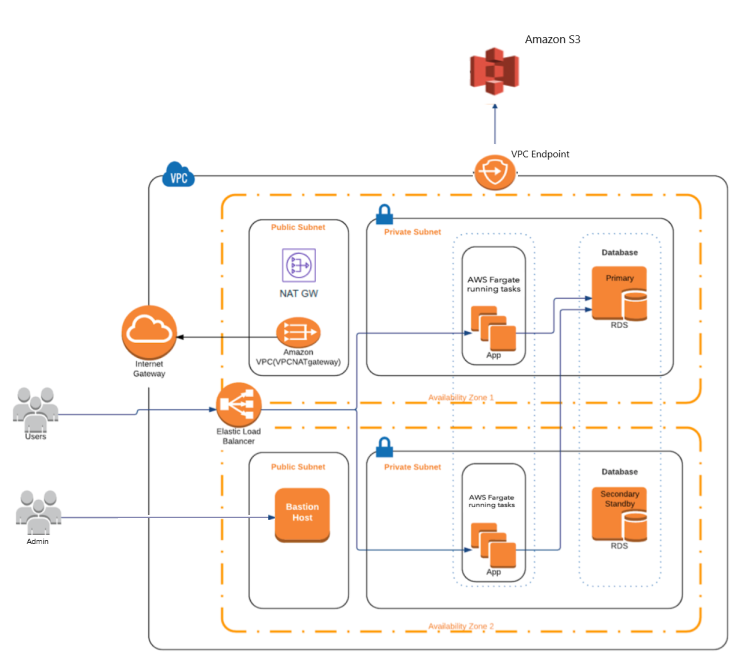

# Architecture
The AWS solution is depicted in the diagram below.

#### Summary
Terraform will create an ECS Fargate cluster and the necessary infrastructure to support ECS applications (RDS database, VPC Endpoint, Bastion host for admin work).

#### Important info
- It will by default deploy the docker image blankia/hello-world https://github.com/roeldenblanken/docker-hello-world
- You can plug this project into a CI/CD pipeline ("infra"-type)

# Deployment Instructions
Install Terraform. Clone this project. 

1. Open console in [dev](envs/dev) folder. 
2. Configure the terraform backend (S3 Bucket and DynamoDB table as instructed in the env.tf file). 
3. Then usual export AWS_ACCESS_KEY_ID=, AWS_SECRET_ACCESS_KEY=, AWS_DEFAULT_REGION=eu-west-1 and terraform init, get, plan and apply commands.
4. The infrastructure will be provisioned.

# CI/CD 
This project can be plugged in the following CI/CD pipeline: https://github.com/roeldenblanken/aws-terraform-code-pipeline-ci-cd-example

Make use of the "infra"-type CI/CD pipeline.

# Reference CI/CD architecture
A full CI/CD example including infra and ECS app would look like below

# Requirements

Requires the following secure parameters to be present in the AWS SSM Parameter store.

| Parameter | Description |
| ------------- | ------------- |
| DB_PASSWORD  | The password that needs to be used when provisioning the RDS database.   |

